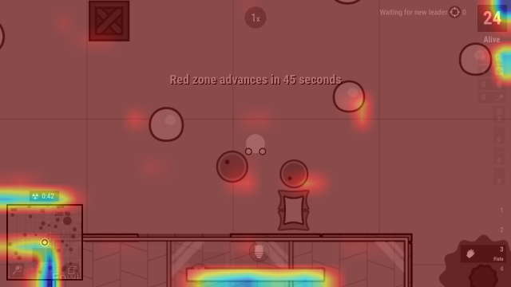

I got bored, so what if I tasked myself to make a neural network play a 2d battle royale shooter game? So for the basics, [survev](https://survev.io/) is just a clone of the original surviv.io, where you basically just play 5 ish minutes games against other players, wanting to be the last one alive. It seems simple enough, with the inputs just being mouse aim, wasd, and some other keys.

Let's start with the game interface:
---

I decided to use selenium so I have built in screen capture methods, and also direct input control without the complexity of hooking into the game, and also without too much overhead. I initially used the built in `driver.get_screenshot_as_png()` method to take screenshots of the game for the neural network, but it was a bit slow, and I discovered that you could directly interface with the chrome dev tools to capture a screenshot faster, with `driver.execute_cdp_cmd("Page.captureScreenshot", {...args})`

Anyways with all of that key_down and key_up coding overhead over with, I was deciding between different input representations. One side, I would have which keys are being held down for movement and interaction, then another I'd have the cursor position. These were really different data types, as keys being held down was just a boolean state while the cursor was a vector/array of x and y coordinates.

I decided to separate it like the internal game data does, boolean 0s and 1s for keys being held down, but an additional value being whether or not to move the mouse. Then I'd have a separate input for moving the mouse when applicable, if the `move` enumeration of the keys was set to 1.

Neural network "heads"?
---

I'm still pretty clueless about how this works, and I'm just going to play around with the different values, but a large part of this I did use an llm to make... There were two different outputs from the neural network that I was seeking to get: one array of binary states, and another vector of two values from 0-1 (ratio of the screen the cursor is at).

I thought of each neural network as just a large matrix operation, the general gist I've always been told. With different layers in this neural network, I thought of the segmentation between the "backbone" of the neural network and each "head." If the backbone is shared between all the "heads," naturally each "head" would operate on the same backbone. If each layer was just a different abstraction of the data, then the backbone being the closest to the raw image data would be the main percieving element of the neural network. On this data, each head could independently decide on different output forms.

I had one head dedicated to a boolean state output of 21 something keys, and then I had a vector of two numbers between 0-1. Each head takes in an input of the base backbone CNN, and makes predictions based off of that.

Initial configuration
---

I have it set on the torch Adam optimizer, with:

```
lr = 3e-4
n_steps = 2048
n_epochs = 4
batch_size = 64
gamma = 0.99
gae_lambda = 0.95
clip_eps = 0.2
value_coeff = 0.5
entropy_coeff = 0.01
max_grad_norm = 0.5
step_time = 0.2
```

while the reward function looks like +0.1 if the bot is alive, +10 for each kill, and 0.1 for each health point change (negative for losing health, positive for healing). When the bot dies, it is peanlized by up to -20, and for each kill it gets, it has a penalty reduction of 2 up to 15. If the bot wins, it gets a +100 reward.

I'm just going to play around with these values for now, and once we get a good amount of steps and eps in, I'll consider tweaking it around and learning what everything means better while I go.

Graphs
---
I've decided to put this project on pause and just post what I have so far, so here's a bit of data I've collected over the training process. Take a look at my source code repo [here](https://github.com/alany08/funny-survev-bot/) if you'd like! (If you know what's wrong, I'd appreciate some help too :D)

```{ojs}
//| code-fold: true
//| code-summary: "Graph OJS Code"
//| label: entropy
//| fig-cap: "The entropy is decreasing, but really the bot isn't learning much as below you can see the mean reward hasn't really changed"

data = FileAttachment("training_logs.csv").csv({typed:  true})

Plot.plot({
    marks: [
        Plot.dot(data, {x: "step", y: "entropy"})
    ]
})
```

```{ojs}
//| code-fold: true
//| code-summary: "Graph OJS Code"
//| label: mean-reward
//| fig-cap: "Almost all negative - dying and taking damage. The reward does go positive a little bit, as the bot presumably healed, but at around 50 I did have an issue and the bot just got 0.1"

Plot.plot({
    marks: [
        Plot.dot(data, {x: "step", y: "mean_reward"})
    ]
})
```

```{ojs}
//| code-fold: true
//| code-summary: "Graph OJS Code"
//| label: value-loss
//| fig-cap: "This also looks pretty random, but if you squint a lot I guess you can see that the value loss is decreasing a little bit at the start. But still it's all over the place, and after the error at step=50 it skyrocketed and went back to oscillating between 0 and 4. This means that the critic head has no clue what's a good game state and what a bad one is. Pretty much means that my model isn't learning anything other than hold down W and pray"

Plot.plot({
    marks: [
        Plot.dot(data, {x: "step", y: "value_loss"})
    ]
})
```

Commentary
---
At steps 19-21, my page crashed or something and ep did not increase and the entropy started crashing and the reward stagnated at the default value... uh oh. I have a last backup at step 9, I'm going to try training through anyways.

Also, attempting to log entropy of the key output and entropy of the aim output head, aim has negative entropy consistently??

It's step 50 now, and I think the agent is sort of dodging bullets and avoiding the red zone? It looks like value loss is not converging properly so the critic head is still very noisy which makes the other stuff not work. I need it to converge first, and entropy is dropping slowly without a change in mean_reward...

I'll try tweaking the batch size to 256 (from 64), since that makes a smoother regression. I'll just change that, and save the current step 50 model. Anyways for now it still looks like random movements, maybe more wasd than other keys since it learned pressing wasd is better than standing still?

Step 70, I decided to inspect the CNN embedding status, as that has to come before everything. It has learned *something*, but it just realizes the health bar has not much of an impact and neither does the minimap. Otherwise everything is blazing red on activation.



This is going very slowly, so I'm thinking of doing manual labeling for the CNN embeding backbone / supervised training instead of letting it pick that up along with the gameplay. I tried using resnet18 and viewed it's activations on a survev screenshot, but no luck... I'm gonna try just making labeled data by playing the game while logging my keypresses.

Alright the prelabeled data isn't really working, and I'm considering starting from scratch since by two days, surely it should be able to get basic feature recognition by now...

I've sort of got the hang of things, so let me try my hand at this later from scratch

 - Have more frequent rewards...
 - Maybe use something other than GAE for update()?
 - Pretrain the CNN using supervised training instead?