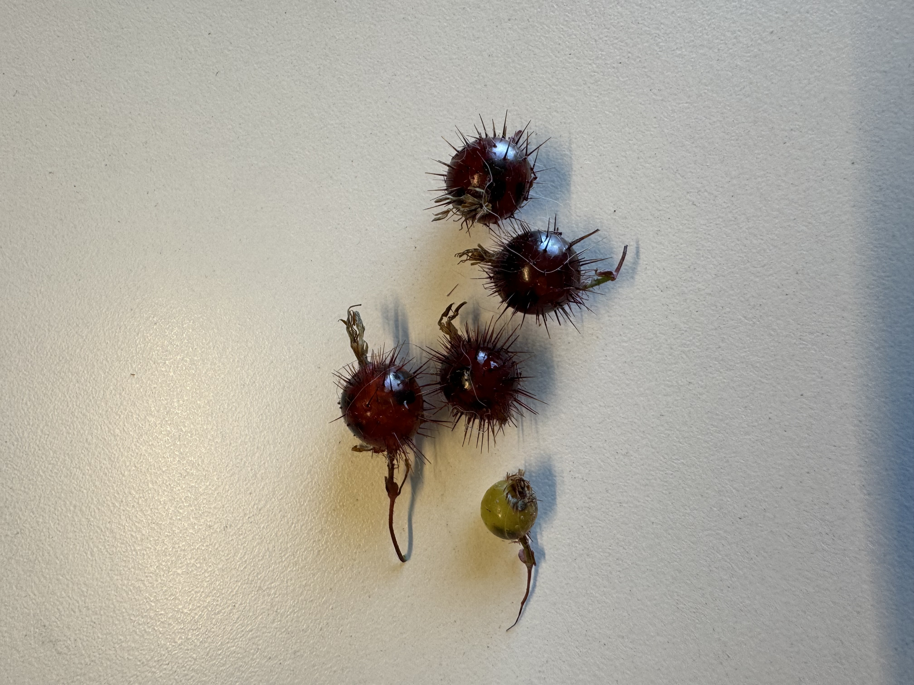
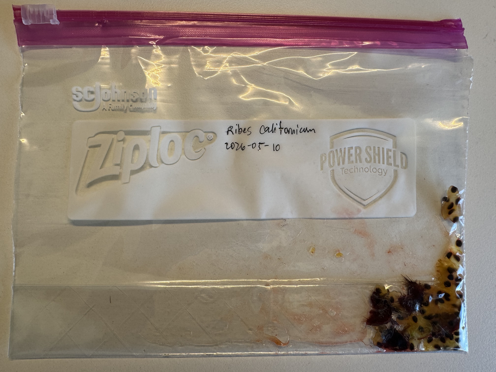

{.lightbox}

Some basic info...
---

This plant does appear in the [calscape database](https://calscape.org/Ribes-californicum-(Hillside-Gooseberry)), and it's native to California so it's most likely beneficial to plant this for the environment. The bush was originally found near a creek in a partially shady area, but the [Wikipedia page](https://en.wikipedia.org/wiki/Ribes_californicum) does list this plant as belonging to chaparral communities. Also as I'm writing this, it seems like the Wikipedia page has a dead link to USDA's database. Fixing that...

The bush also contains a decent amount of thorns and I was pricked quite a bit by them, and it's pretty evident from the berries as well. Also, most berries need cold stratification, however I'm not completely sure about this.

Some more information to note that may be useful as reference for anybody who wants to find this plant though:

- The berries ripen around May in my coastal CA region
- They are quite prickly, so careful when trying to collect berries
- Usually found in partially shady areas, as undergrowth

[CNPS](https://www.cnps.org/gardening/california-native-plant-propagation-4014) (California Native Plant Society, cool organization!) has a page about native plant propagation, it also happens to include this plant! However, it does seem that most berries like these include chemical inhibitors within the pulp to prevent germination, and ensure they only germinate after being ingested by an animal. They name a method of fermenting the mashed pulp before germination for another *Ribes* species, so I will be attempting that for these berries I have.

However, I'm not certain about the need for cold stratification, so I will try half in the refrigerator for a week, and another half directly in pots outdoors with consistent moisture (it's currently May, and I'm in around USDA zone 9b. I think this is enough to start trying to propagate this plant, lets get to preparing!

For my germination procedure:

- Mash and ferment the berries for around a week
- Clean berries of pulp
- Place half of the beries on wet paper towel in the fridge for a week, then also plant in that compost mix
- Place other half in a compost-sand mix outdoors
- Water and hope they grow

Germination
---

I've mashed the berries, this is what they look like, I'm going to leave them for around a week, but I'll be back with updates in case less than a week is necessary. The seeds are very dark, and they're actually visible in the first picture through the red skin. The pulp looks like grape, and tastes sort of like grape pulp, and it's not sour (I ate one of them beforehand). The seeds are chewy and don't really taste like anything. It's just mildly sweet.

